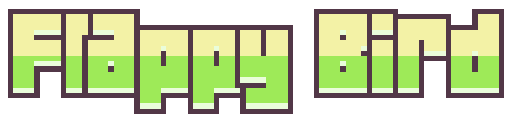

# FlappyBird: Leo0liveira

[]
[!License](https://img.shields.io/github/license/Leo0liveira/FlappyBird)](https://github.com/afonsopacifer/open-source-boilerplate/blob/master/LICENSE.md)

Estudo de como criar um jogo com JS.

  

